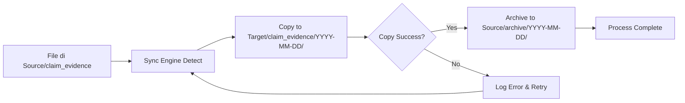

# SFTP Data Processing Simulation - Best Practice Setup

Proyek ini menyediakan server SFTP lokal menggunakan Docker untuk mensimulasikan alur kerja pemrosesan data bukti klaim (*claim evidence*) dengan **dua SFTP servers** untuk testing dan development. Setup ini mengikuti **best practice** untuk development environment yang efisien dan mudah dikelola.

## Table of Contents

- [🎯 Overview](#-overview)
- [✨ Fitur Utama](#-fitur-utama)
- [🚀 Quick Start](#-quick-start)
- [🛠️ Management Commands](#️-management-commands)
- [📁 Directory Structure](#-directory-structure)
- [🔑 Connection Details](#-connection-details)
- [📋 Alur Kerja Workflow](#-alur-kerja-workflow)
- [🧪 Testing Workflow](#-testing-workflow)
- [📚 Documentation](#-documentation)
- [🔧 Advanced Configuration](#-advanced-configuration)
- [🐛 Troubleshooting](#-troubleshooting)
- [🔒 Security Best Practices](#-security-best-practices)
- [🚀 Production Deployment](#-production-deployment)

## 🎯 Overview

Setup ini menyediakan **dua SFTP servers** dalam satu Docker Compose configuration:

### Server Configuration

| Server | Port | Simulation IP | Purpose |
|--------|------|---------------|---------|
| **Source Server** | 2222 | 1.1.1.1 | Server sumber untuk file claim evidence |
| **Target Server** | 2223 | 2.2.2.2 | Server tujuan untuk file yang diproses |

### Why This Setup is Best Practice

| Aspect | Benefit |
|--------|---------|
| **Simplicity** | Single docker-compose.yml manages both servers |
| **Isolation** | Independent containers dengan port berbeda |
| **Data Persistence** | Local mounted volumes menyimpan data |
| **Automation** | Helper script `manage-sftp.sh` untuk operasi mudah |
| **Integration** | Auto-check di sync engine mencegah errors |
| **Scalability** | Mudah menambah server baru |

## ✨ Fitur Utama

### ✅ Complete Testing Environment
- Dua SFTP servers yang ready-to-use
- Automated setup dan teardown
- Data persistence antar restart

### ✅ Easy Management
- Single command untuk start/stop servers
- Built-in status checking
- Comprehensive logging

### ✅ Developer Friendly
- Clear directory structure
- Sample configuration
- Complete documentation

### ✅ Production Mirroring
- Local setup mirrors production architecture
- Mudah switch antara environment
- Same workflow, different hosts

## 🚀 Quick Start

### Prerequisites

```bash
# Cek apakah Docker dan Docker Compose terinstall
docker --version
docker-compose --version
```

### 3 Langkah Mulai

```bash
# 1. Start SFTP servers
cd C:\Users\dihar\workspace\SFTP
./manage-sftp.sh start

# 2. Verifikasi servers running
./manage-sftp.sh status

# 3. Run sync engine
cd ../jalin/dev/engine
./startSync.sh
```

Expected output:
```
Starting SFTP servers...
✓ Target directories created
✓ SFTP servers started successfully

Server Status:
  Source Server: Running (localhost:2222)
  Target Server: Running (localhost:2223)
```

## 🛠️ Management Commands

### manage-sftp.sh Script

```bash
./manage-sftp.sh start    # Start kedua SFTP servers
./manage-sftp.sh stop     # Stop kedua SFTP servers
./manage-sftp.sh restart  # Restart kedua servers
./manage-sftp.sh status   # Cek status running servers
./manage-sftp.sh logs     # View container logs
./manage-sftp.sh info     # Show connection details
```

### Command Details

| Command | Description | Output |
|---------|-------------|--------|
| `start` | Start both servers | Status masing-masing server |
| `stop` | Stop both servers | Confirmation message |
| `status` | Check running status | Uptime, port, health |
| `logs` | Show recent logs | Real-time log output |
| `info` | Connection details | Host, port, credentials |

## 📁 Directory Structure

```
C:\Users\dihar\workspace\SFTP\
├── source_data/                    # Source SFTP server data
│   ├── claim_evidence/             # Input files (simulasi IP 1.1.1.1)
│   └── archive/                    # Archived files setelah copy
│       └── YYYY-MM-DD/             # Daily archive folders
├── target_data/                    # Target SFTP server data
│   ├── claim_evidence/             # Copied files (simulasi IP 2.2.2.2)
│   │   └── YYYY-MM-DD/             # Daily organized folders
│   └── archive/                    # Archive location
├── docker-compose.yml              # Docker Compose config (2 SFTP services)
├── manage-sftp.sh                  # Management script
├── README.md                       # This file
├── SFTP_SETUP_GUIDE.md             # Complete technical documentation
└── BEST_PRACTICE_SOLUTION.md       # Implementation details
```

## 🔑 Connection Details

### Source Server (IP 1.1.1.1 Simulation)

| Parameter | Development | Production |
|-----------|-------------|------------|
| **Host** | localhost | 1.1.1.1 |
| **Port** | 2222 | 22 |
| **Username** | tester | [production_user] |
| **Password** | password123 | [production_password] |
| **Path** | `/home/tester/claim_evidence` | `/claim_evidence` |

### Target Server (IP 2.2.2.2 Simulation)

| Parameter | Development | Production |
|-----------|-------------|------------|
| **Host** | localhost | 2.2.2.2 |
| **Port** | 2223 | 22 |
| **Username** | tester | [production_user] |
| **Password** | password123 | [production_password] |
| **Path** | `/home/tester/claim_evidence` | `/claim_evidence` |

## 📋 Alur Kerja (Workflow)

### Sync Engine Process

Aplikasi Sync Engine melakukan proses berikut:

1. **Copy**: File diambil dari Source SFTP (`/claim_evidence`) ke Target SFTP (`/claim_evidence/YYYY-MM-DD/`)
2. **Archive**: Setelah copy berhasil, file asli dipindahkan ke Source SFTP (`/archive/YYYY-MM-DD/`)

### Visual Workflow

```
┌─────────────────────────────────────────────────────────────────────┐
│                        SYNC ENGINE WORKFLOW                          │
└─────────────────────────────────────────────────────────────────────┘

Source Server (Port 2222)              Target Server (Port 2223)
┌──────────────────────┐              ┌──────────────────────────┐
│ /claim_evidence/     │              │ /claim_evidence/         │
│   ├── file1.jpg  ────┼─────copy────→│   ├── 2026-03-08/        │
│   └── file2.png      │              │   │   ├── file1.jpg      │
│                      │              │   │   └── file2.png      │
│ /archive/            │              │   └── ...                │
│   └── 2026-03-08/    │              │                          │
│       ├── file1.jpg←─┼──archive─────│                          │
│       └── file2.png  │              │                          │
└──────────────────────┘              └──────────────────────────┘
```

### Process Flow



## 🧪 Testing Workflow

### Complete Test Scenario

#### Step 1: Prepare Test Files

```bash
# Copy test files ke source directory
cp /path/to/test1.jpg source_data/claim_evidence/
cp /path/to/test2.png source_data/claim_evidence/
cp /path/to/test3.pdf source_data/claim_evidence/

# Verify files copied
ls source_data/claim_evidence/
```

#### Step 2: Start SFTP Servers

```bash
./manage-sftp.sh start
```

Expected output:
```
Starting SFTP servers...
✓ Target directories created
✓ SFTP servers started successfully
```

#### Step 3: Run Sync Engine

```bash
cd ../jalin/dev/engine
./startSync.sh
```

The script akan:
- ✅ Check jika SFTP servers running
- ✅ Warn jika servers belum start
- ✅ Prompt untuk continue atau abort
- ✅ Start application dengan proper checks

#### Step 4: Verify Results

```bash
# Check source (should be empty - files archived)
ls source_data/claim_evidence/

# Check archive (files should be here)
ls source_data/archive/2026-03-08/

# Check target (files should be copied here)
ls target_data/claim_evidence/2026-03-08/
```

#### Step 5: Check Logs

```bash
# View sync engine logs
tail -f ../jalin/dev/engine/logs/sync_engine_*.log

# View SFTP server logs
./manage-sftp.sh logs
```

## 📚 Documentation

### Available Documentation

| Document | Description | Link |
|----------|-------------|------|
| **README.md** | This file - Overview dan quick start | [Current File](README.md) |
| **SFTP_SETUP_GUIDE.md** | Complete technical setup guide | [View](SFTP_SETUP_GUIDE.md) |
| **BEST_PRACTICE_SOLUTION.md** | Implementation details & rationale | [View](BEST_PRACTICE_SOLUTION.md) |
| **Feature Documentation** | Sync engine feature details | [../jalin/dev/engine/SFTP_COPY_FEATURE.md](../jalin/dev/engine/SFTP_COPY_FEATURE.md) |
| **Quick Start Guide** | Quick start untuk sync engine | [../jalin/dev/engine/SFTP_COPY_QUICK_START.md](../jalin/dev/engine/SFTP_COPY_QUICK_START.md) |

## 🔧 Advanced Configuration

### Manual Docker Commands

```bash
# Start servers manually
docker-compose up -d

# Stop servers
docker-compose down

# View logs
docker-compose logs -f sftp-source
docker-compose logs -f sftp-target

# Check container status
docker ps -a | grep sftp

# Access container shell
docker exec -it sftp_source_server bash
docker exec -it sftp_target_server bash

# Restart specific server
docker-compose restart sftp-source
docker-compose restart sftp-target
```

### Custom Configuration

#### Add New SFTP Server

Edit `docker-compose.yml`:

```yaml
services:
  sftp-source:
    # ... existing config ...

  sftp-target:
    # ... existing config ...

  sftp-archive:  # New server
    image: atmoz/sftp
    container_name: sftp_archive_server
    ports:
      - "2224:22"
    volumes:
      - ./archive_data:/home/tester/data
    command: tester:password123:::data
```

#### Change Ports

Edit `docker-compose.yml`:

```yaml
services:
  sftp-source:
    ports:
      - "3022:22"  # Changed from 2222

  sftp-target:
    ports:
      - "3023:22"  # Changed from 2223
```

### Application Configuration

#### Development Config (application.yaml)

```yaml
sync:
  sftp-copy:
    enabled: true
    interval: 60000  # Check every 60 seconds

  sftp:
    source:
      host: localhost
      port: 2222
      username: tester
      password: password123
      path: /claim_evidence

    target:
      host: localhost
      port: 2223
      username: tester
      password: password123
      path: /claim_evidence
      date-folder: true  # Organize by date
```

### Manual Testing dengan SFTP Client

```bash
# Test source server connection
sftp -P 2222 tester@localhost

# Test target server connection
sftp -P 2223 tester@localhost

# Inside SFTP client:
# ls - List files in current directory
# pwd - Print working directory
# cd <dir> - Change directory
# put <file> - Upload file to server
# get <file> - Download file from server
# rm <file> - Remove file
# rmdir <dir> - Remove directory
# quit - Exit SFTP client
```

## 🐛 Troubleshooting

### Common Issues & Solutions

#### Issue 1: Port Already in Use

**Symptom:**
```
Error: Bind for 0.0.0.0:2222 failed: port is already allocated
```

**Solution:**
```bash
# Windows - Check what's using the port
netstat -ano | findstr :2222
netstat -ano | findstr :2223

# Kill the process (replace <PID> with actual process ID)
taskkill /PID <PID> /F

# OR change ports in docker-compose.yml
```

#### Issue 2: Container Won't Start

**Symptom:**
```
Container exited with code 1
```

**Solution:**
```bash
# Check logs for errors
docker logs sftp_source_server
docker logs sftp_target_server

# Remove volumes and recreate
docker-compose down -v
docker-compose up -d

# Verify directory permissions
ls -la source_data/
ls -la target_data/
```

#### Issue 3: Files Not Copied

**Symptom:**
Files remain in source but not copied to target

**Solution:**
```bash
# 1. Verify servers running
./manage-sftp.sh status

# 2. Check application logs
tail -f ../jalin/dev/engine/logs/sync_engine_*.log

# 3. Verify configuration
cat ../jalin/dev/engine/application.yaml

# 4. Test SFTP connection manually
sftp -P 2222 tester@localhost
sftp -P 2223 tester@localhost

# 5. Check file permissions
ls -la source_data/claim_evidence/
```

#### Issue 4: Permission Denied

**Symptom:**
```
Permission denied (publickey,password)
```

**Solution:**
```bash
# Verify credentials
./manage-sftp.sh info

# Reset container
docker-compose down
docker-compose up -d

# Check if correct username/password
```

### Debug Mode

Enable verbose logging:

```bash
# View Docker logs with timestamps
docker-compose logs --tail=100 -f --timestamps

# Check sync engine with debug
cd ../jalin/dev/engine
DEBUG=* ./startSync.sh
```

### Health Check Script

```bash
#!/bin/bash
# health-check.sh

echo "Checking SFTP servers..."

# Check if containers running
if docker ps | grep -q sftp_source_server; then
    echo "✓ Source server running"
else
    echo "✗ Source server NOT running"
fi

if docker ps | grep -q sftp_target_server; then
    echo "✓ Target server running"
else
    echo "✗ Target server NOT running"
fi

# Test connections
timeout 5 bash -c "cat < /dev/null > /dev/tcp/localhost/2222" && echo "✓ Port 2222 accessible" || echo "✗ Port 2222 NOT accessible"
timeout 5 bash -c "cat < /dev/null > /dev/tcp/localhost/2223" && echo "✓ Port 2223 accessible" || echo "✗ Port 2223 NOT accessible"
```

## 🔒 Security Best Practices

### Development Environment ✅

- ✅ Default credentials OK
- ✅ Localhost only OK
- ✅ Non-standard ports OK
- ✅ Basic authentication OK

### Production Environment ❌

Untuk production, wajib mengimplementasikan:

- ❌ **Change default passwords** - Gunakan strong passwords
- ❌ **Use SSH keys** - Implement key-based authentication
- ❌ **Restrict IP access** - Whitelist allowed IPs
- ❌ **Enable firewall** - Limit access to necessary ports
- ❌ **Use VPN** - Secure connection untuk remote access
- ❌ **Enable audit logging** - Track semua file operations
- ❌ **Regular security updates** - Keep Docker image updated

### Production Configuration Example

```yaml
sync:
  sftp:
    source:
      host: 1.1.1.1
      port: 22
      username: ${SFTP_SOURCE_USER}      # Environment variable
      password: ${SFTP_SOURCE_PASSWORD}  # Environment variable
      key-file: /path/to/private_key     # SSH key authentication

    target:
      host: 2.2.2.2
      port: 22
      username: ${SFTP_TARGET_USER}
      password: ${SFTP_TARGET_PASSWORD}
      key-file: /path/to/private_key
```

## 🚀 Production Deployment

### Pre-Deployment Checklist

- [ ] Change default passwords
- [ ] Configure SSH keys
- [ ] Setup firewall rules
- [ ] Configure VPN if needed
- [ ] Setup monitoring & alerts
- [ ] Configure backup strategy
- [ ] Test failover procedures
- [ ] Document IP whitelist
- [ ] Setup log aggregation
- [ ] Configure SSL/TLS certificates

### Configuration Changes

#### Update Host Configuration

```yaml
# production-application.yaml
sync:
  sftp:
    source:
      host: 1.1.1.1          # Actual source IP
      port: 22               # Standard SSH port
      username: sftp_user
      password: ${SFTP_PASSWORD}

    target:
      host: 2.2.2.2          # Actual target IP
      port: 22
      username: sftp_user
      password: ${SFTP_PASSWORD}
```

#### Environment Variables

```bash
# .env file
SFTP_SOURCE_USER=production_user
SFTP_TARGET_USER=production_user
SFTP_SOURCE_PASSWORD=secure_password_here
SFTP_TARGET_PASSWORD=secure_password_here
```

### Deployment Steps

```bash
# 1. Backup current configuration
cp application.yaml application.yaml.backup

# 2. Update configuration
vim production-application.yaml

# 3. Test connection
sftp sftp_user@1.1.1.1
sftp sftp_user@2.2.2.2

# 4. Deploy application
scp production-application.yaml user@server:/path/to/config/
ssh user@server "cd /path/to/app && ./deploy.sh"

# 5. Verify deployment
ssh user@server "systemctl status sync-engine"
```

## 📞 Support & Resources

### Getting Help

1. **Documentation** - Cek dokumentasi lengkap di `SFTP_SETUP_GUIDE.md`
2. **Logs** - Review logs di `../jalin/dev/engine/logs/`
3. **Issues** - Check existing issues atau create new one
4. **Best Practices** - Review `BEST_PRACTICE_SOLUTION.md`

### Useful Commands

```bash
# Quick status check
./manage-sftp.sh status

# View logs
./manage-sftp.sh logs

# Connection info
./manage-sftp.sh info

# Restart services
./manage-sftp.sh restart
```

### Additional Resources

- [Docker SFTP Image Documentation](https://github.com/atmoz/sftp)
- [SFTP Protocol Specification](https://tools.ietf.org/html/draft-ietf-secsh-filexfer-13)
- [Docker Compose Documentation](https://docs.docker.com/compose/)

---

## 📝 Summary

Setup ini menyediakan:

✅ **Complete testing environment** - Dua SFTP servers siap pakai
✅ **Simple management** - Single command operations
✅ **Reliable operation** - Auto-checks dan error prevention
✅ **Well documented** - Comprehensive guides dan examples
✅ **Production ready** - Mudah diadaptasi untuk production

**Best practice achieved!** ✨

---

*Last Updated: 2026-03-08*
*Version: 1.0.0*
*Maintainer: Development Team*
